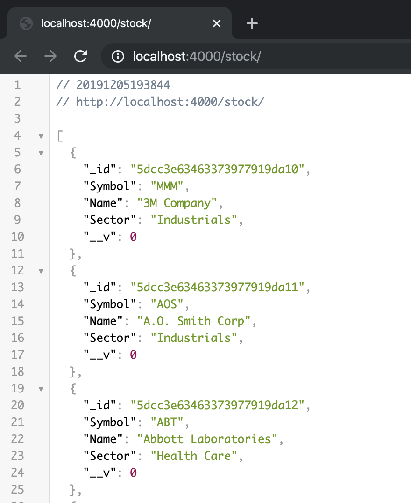
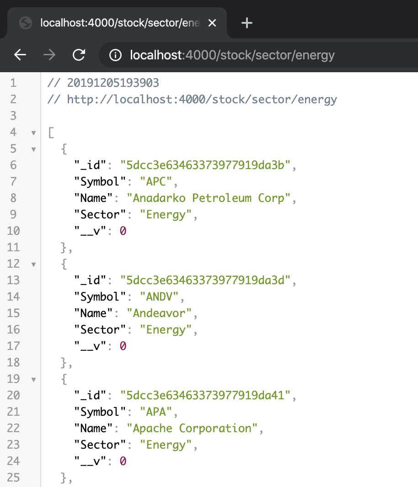

#  **Stock Information API** 

## Mongo Database of the S&P 500

This project is a functioning Application Programming Interface that allows users to browse through, delete, update, and create various popular companies that are on the stock market.

The database is set up in objects (like in the above picture), providing their formal company name, company stock (or ticker) symbol, and the formal sector they belong to.

The companies are visible by their symbol, like in the above picture.

The companies are visible by their sector, like in the above picture.

### How to Use

Base URL: /stock
_Table 1_

|   Query    |           Path           | Description                                           |
| :--------: | :----------------------: | ----------------------------------------------------- |
|  **POST**  |         `/stock`         | create a new object/entry                             |
|  **GET**   |         `/stock`         | browse all objects in database                        |
|  **GET**   | `/stock/symbol/{symbol}` | find by company's ticker symbol                       |
|  **GET**   | `/stock/sector/{sector}` | find company by sector                                |
|  **GET**   |      `/stock/{id}`       | find company by id generated through the database     |
| **DELETE** |      `/stock/{id}`       | find an object by the id and delete the entire object |

### Features

Using Express.js and MongoDB, I created an API that has full CRUD, meaning it has the ability to create new objects, edit existing objects, read existing objects, and deleting existing objects.

### Future Goals

In the very near future, I will be using this API and creating a full-stack application that incorporates another API called "Alpha Vantage" to update each stock with real-time data of the stock, when a company name is clicked on or searched.

### Thanks

Thanks to the S&P 500 list for the information to fill the API!
